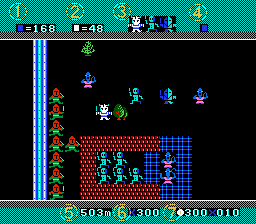
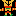
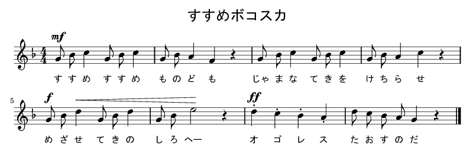
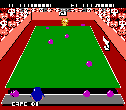

ボコスカウォーズ (FC) 取扱説明書
================================

| このたびは「ボコスカウォーズ」をお買い上げいただきまして, 誠にありがとうご
  ざいます.
| ゲームを始める前にこの説明書を読むと, より楽しく遊ぶことができます. 正しい
  方法で遊びましょう.

箱裏
----

| **二味ちがうロールプレイング**
| **ボコスカウォーズついに登場!!**

時は中世, 平和なスレン王国は, バサム帝国の暴君オゴレスにより征服されてしまっ
た. その時, スレン王の兵士たちは全員木や岩に変えられてしまったのであった. ス
レン王はひとりバサム城をめざし反撃を開始したのだが……. さあ無事49人の兵士た
ちを助け出し, オゴレス王を倒すことができるだろうか!

説明書
------

使用上の注意
^^^^^^^^^^^^

1. 精密機器ですので, 極端な温度条件下での使用や保管, および強いショックを与
   えないよう注意してください. また絶対に分解しないでください.
2. 故障の原因になりますので, 端子部に手を触れたり, 水にぬらすなど汚さないで
   ください.
3. シンナー, ベンジン, アルコール等の揮発油でふかないでください.
4. カセット交換の際は, 必ず電源をお切りください.
5. テレビ画面から, できるだけ離れてゲームをしてください.
6. 長時間ゲームをする時は, 健康のため, 約2時間ごとに10分から15分の小休止をし
   てください.

ストーリー
^^^^^^^^^^

ときは中世. バサム帝国の暴君オゴレスは世界征服をたくらみ, 隣のスレン王国に攻
め入った. スレン王国は, バサム帝国の強大な軍事力にかなうはずもなく, 帝国に支
配されることになった. さらにこのときオゴレス王は, スレン王の兵士たちを木や岩
に変えてしまったのだった. しかし, スレン王にもついに反撃をするチャンスがきた.
ある日, 街で出会った魔女がその魔法をとく術を教えてくれたのだ. スレン王はたっ
たひとりでバサム城に向かって突撃を開始した. 兵士たちを助け出し. 再び隊を組み
オゴレス王を倒すのだ.

ゲームのルール
^^^^^^^^^^^^^^

| 君はスレン王となり, 騎士と兵卒を連れバサム城に攻め入り, 宿敵であるオゴレス
  を倒すのだ. バサム上までの600メートルの道程には, 兵士達が変身させられた木
  や岩があり, 捕らわれている兵卒や数多くの罠が待ち受けている.
| オゴレスを倒すと勝ちとなり, 次のレベルに進む. 途中でスレン王が死んでしまう
  とゲームオーバーだ.

|screen|

1. 敵の総数
2. 味方の総数(変身している兵士や囚われている兵士を含む)
3. 操作できる味方の種類
4. レベルの表示
5. オゴレスまでの距離
6. 王の強さ
7. 敵と味方の強さを表し, ○×で勝敗を表示

移動について
""""""""""""
騎士や兵卒は個々に移動できるわけではない. 騎士は騎士ごと, 兵卒は兵卒ごと, あ
るいは王を含めて味方全員を操らなければならない.

戦闘について
""""""""""""
敵に体当たりをすると戦闘になり, 戦闘マーク(B:バトルマーク)が表示される. 戦闘
は敵味方それぞれの強さとそのときの運によって勝敗が決まる.

兵士を助けるには
""""""""""""""""
兵士をもとの姿に戻すことができるのは, スレン王だけだ. 途中の木や岩を押してみ
よう. どれが兵士の変身したものなのかは, 体当たりしてみなければわからない.

ゲームのレベル
""""""""""""""

このゲームのレベルは5段階ある. オゴレスを倒すごとにレベルが上がり, 敵の強さ
が10上がる.

操作方法
^^^^^^^^

十字キー
  味方の隊を操作する.
START
  ゲームを始める.
A, B
  移動させる味方を選ぶ. 全員→王→兵卒→騎士の順に変わる.(画面上中央に表示)

※このゲームはこちらから攻撃しないかぎり, 向うからは攻撃してこないので, いつ
でもゲームプレイを中断できる. 従ってポーズ機能はない.

キャラクタ紹介
^^^^^^^^^^^^^^

スレン王国側
""""""""""""

味方の登場人物は戦闘に勝つと, 強さが10ずつ強くなっていく. また, それぞれに重
要な役割をもっているので, 障害にぶつかったらもう一度よく考えてみよう.

王 |friend-king| 強さ220～320
  画面は王を中心に左右にスクロールをし, 敵は領地の中に王が入って来ると活動を
  始める.
騎士 |friend-knight| 強さ150～310
  騎士は4連勝すると重騎士に昇格し, このときさらに強さが80強くなる.
兵卒 |friend-soldier| 強さ30～310
  兵卒は3連勝すると重兵卒に昇格し, このときさらに強さが80強くなる. 兵卒は人
  質として捕らえれているものもいる.

バサム帝国側
""""""""""""

バサム帝国の登場人物は, レベルが高くなるごとに10ずつ強くなる.

オゴレス王 |enemy-king| 強さ100
  宿敵オゴレスを倒すことができると君の勝ちだ. オゴレスをスレン王以外で倒すの
  は難しいだろう.
親衛隊 |enemy-guard| 強さ250
  バサム城に登場する. 親衛隊は最も強い敵だ.
重騎士 |enemy-heavyknight| 強さ100
  城跡とバサム城に登場する強敵だ. スレン王をしつこく追い回す.
騎士 |enemy-knight| 強さ50
  最初の草原, 次の森林, バサム城の手前の草原に登場する.
兵卒 |enemy-soldier| 強さ10
  騎士と同じく草原, 森林, 荒野に登場する.
魔術師 |enemy-summoner| 強さ30
  岩場とバサム城に登場し, 魔術師のいる場所をスレン王が通り過ぎると魔術師は幻
  戦士を呼び出す.
幻戦士 |enemy-phantom| 強さ50
  幻戦士は倒してもすぐに復活し, しつこくスレン王を追いかけてきます. 主人の魔
  術師を倒すと消える.
獄吏 |enemy-jailer| 強さ30
  牢屋の番人. 牢屋付近で捕慮のスレン軍の兵卒を見張っている.

| ゲーム中に流れている音楽に合わせて「ボコスカウォーズ」の歌を歌おう.
| 歌いながらゲームをすれば勇気100倍!オゴレス王もへっちゃらなのだ!

ボコスカウォーズの歌
^^^^^^^^^^^^^^^^^^^^

.. _susume: susume.ly

| **進め進めものども**
| **じゃまな敵をけちらせ**
| **進め敵の城へ**
| **オゴレス倒すのだ**

|susume|_

[*]_

好評発売中
^^^^^^^^^^

アストロロボSASA 5,500円(〒400)
  プラズマガンを打つ反動で移動する少年ロボットSASAと, かわいいNANAの冒険アク
  ションゲーム.
GEIMOS 5,500円(〒400)
  3D感覚のリアルなシューティングゲーム. 敵の母艦フォボスを倒して太陽系を飛び
  まわれ!
ASCII STICK 8,800円(〒1000)
  操作性, 耐久性とも抜群でゲームセンターそのままの感覚が味わえます.
ぺんぎんくんWARS 5,500円 12月発売予定
  | カワイイぺんぎんくんとネコとパンダなどの動物たちとの愉快なボールゲームです.
  | |penguin|

.. raw:: html

  

.. [*] 元楽譜は誤りがあったので適当に修正しました。なお、本文と楽譜で歌詞が
       違うのはそのままにしてあります。

`Back <../>`_
